<picture>
  <source media="(prefers-color-scheme: dark)" srcset="assets/header.svg">
  <source media="(prefers-color-scheme: light)" srcset="assets/header-light.svg">
  
</picture>

 

<picture>
  <source media="(prefers-color-scheme: dark)" srcset="https://raw.githubusercontent.com/necromancerrr/necromancerrr/output/github-snake-dark.svg">
  
</picture>

 

